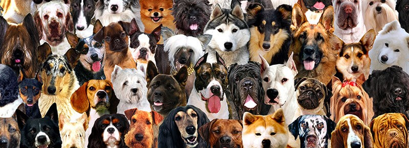
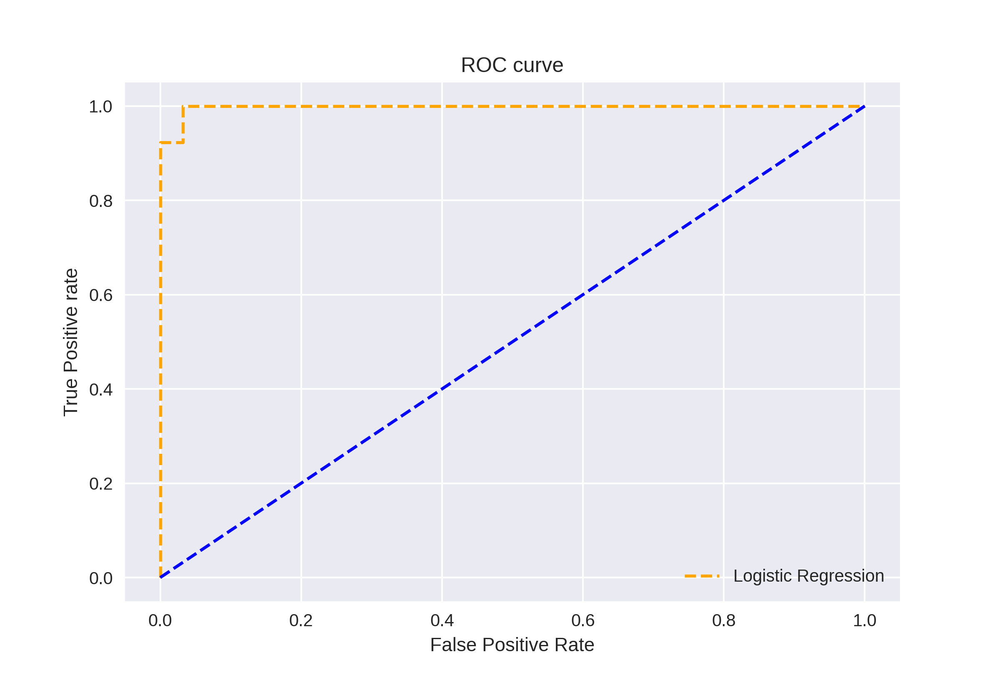
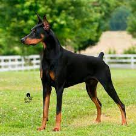

# DL_dog_breed_classification using TensorFlow - 2.0 ResNet50 Classification (Transfer Learning) (Only for 10 Breeds)

Dataset Link : https://www.kaggle.com/c/dog-breed-identification/data

Result :

Training Data :     loss: 0.0239 - accuracy: 0.9964 

Validation/Test :   val_loss: 0.1478 - val_accuracy: 0.9645

Classification Report : 

   Confusion Metrix :
       
    [[21  0  0  0  0  0  0  0  0  0]
    [ 0 12  0  1  0  0  0  0  0  0]
    [ 0  1 14  0  0  1  0  0  0  0]
    [ 0  0  0 11  0  0  0  0  0  0]
    [ 0  1  0  0 20  0  0  0  0  1]
    [ 0  0  0  0  0 16  0  0  0  0]
    [ 0  1  0  0  0  0 14  0  0  0]
    [ 0  0  0  0  0  0  0 18  0  0]
    [ 0  0  0  0  0  0  0  0 24  0]
    [ 0  0  0  0  0  0  0  0  0 13]]
    
  Classification Report :
  
                    precision    recall  f1-score   support

               0       1.00      1.00      1.00        21
               1       0.80      0.92      0.86        13
               2       1.00      0.88      0.93        16
               3       0.92      1.00      0.96        11
               4       1.00      0.91      0.95        22
               5       0.94      1.00      0.97        16
               6       1.00      0.93      0.97        15
               7       1.00      1.00      1.00        18
               8       1.00      1.00      1.00        24
               9       0.93      1.00      0.96        13

        accuracy                           0.96       169
       macro avg       0.96      0.96      0.96       169
    weighted avg       0.97      0.96      0.96       169
    

AUC-ROC Curve :

Output Result : 

doberman

